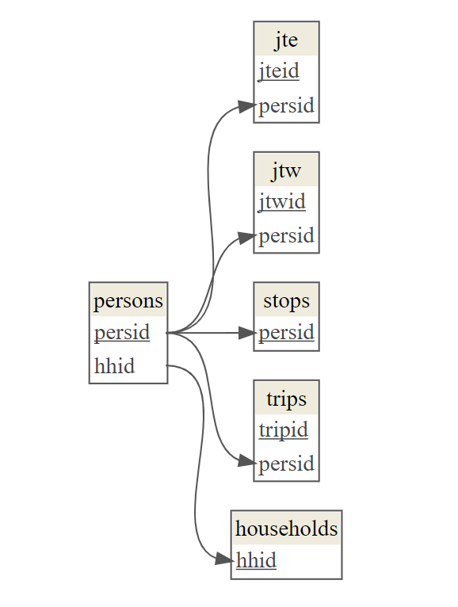

<!-- README.md is generated from README.Rmd. Please edit that file -->

```{r, include = FALSE}
knitr::opts_chunk$set(
  collapse = TRUE,
  comment = "#>",
  fig.path = "man/figures/README-",
  out.width = "100%"
)
```

# [vista](https://github.com/asiripanich/vista) 🚶‍♀️🚲🚗🚌

<!-- badges: start -->
[](https://github.com/asiripanich/vista/actions)
<!-- badges: end -->

✨ **Features** ✨

- Offers `vista_dm`, a [public version of VISTA](https://transport.vic.gov.au/about/data-and-research/vista/vista-data-and-publications) as a relational data model in R, by leveraging on the [{dm}](https://cynkra.github.io/dm/) package.
- 🚧 (coming soon) Converts VISTA and 1% ABS Census Sample File to CVISTA (C here stands for close-enough-to), an intermediate format.

☝️ If you have other versions of VISTA, you can use the `vista_to_dm()` function to convert your VISTA tables into a {dm} object.

## Installation

You can install the released version of vista from GitHub with:

``` r
install.packages("devtools")
devtools::install_github("asiripanich/vista")
```

## Example

```{r screenshot.force = FALSE}
library(vista)
vista_dm
```

``` r
library(dm)
vista_dm %>%
  dm_draw()
```

```{r, out.width="50%", echo=FALSE}

```
